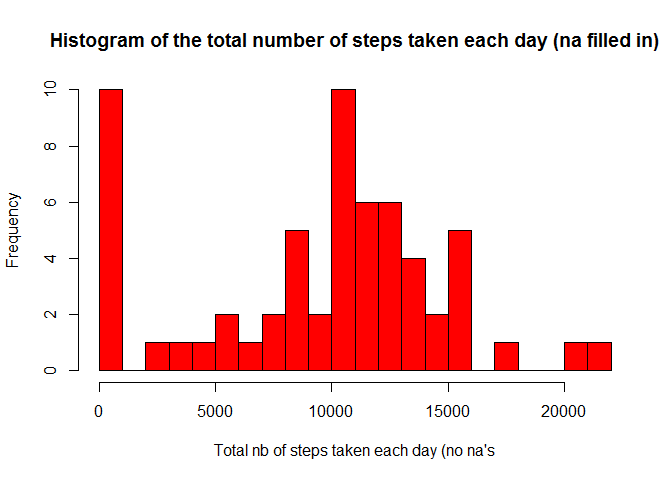

# Reproducible Research: Peer Assessment 1


## Loading and preprocessing the data

```r
setwd("C:/Users/thim/Documents/Coursera/Reproducible Reasearch/RepData_PeerAssessment1/")
unzip(zipfile = "./activity.zip")
data <-read.csv(file = "activity.csv",header = T,sep = ",",colClasses=c("numeric","character", "numeric"))
data$date <- as.Date(data$date, format="%Y-%m-%d")
```


## What is mean total number of steps taken per day?

1. The code in R to calculate what is required for this question:


```r
steps.date <- by(data$steps,data$date,sum) #alternative : 
#steps.date <- aggregate(steps ~ date, data, FUN = sum)$steps
hist(steps.date, col = "blue",
        main = "Histogram of the total number of steps taken each day",
        xlab = "Total nb of steps taken each day",
        breaks = 20)
```

 

2. The histogram of the number of steps per day:


```r
mean <- round(mean(steps.date,na.rm = TRUE))
median <- round(median(steps.date,na.rm = TRUE))
```

3. The mean and the median of total number of steps taken per day:

The average is 10766.  
The mean is 10765.


## What is the average daily activity pattern?

```r
steps.interval <- aggregate(steps ~ interval, data=na.omit(data),
        FUN="mean")

## add descriptive variable names
names(steps.interval)[2] <- "mean_steps"

## format plot margins t
par(mai = c(1.2,1.5,1,1))
```
1. plot of the average number of steps per interval of day

```r
## plot time series
plot( x = steps.interval$interval,
        y = steps.interval$mean_steps,
        type = "l",
        main = "Time series Plot of the 5-Minute interval",
        xlab = "interval",
        ylab = "steps"
)
```

 

```r
max.interval <- steps.interval[which.max(steps.interval$mean_steps),1]
```

2. The interval of a day with the average maximum number of steps is the 835 th.


## Imputing missing values
1. The total number of missing values in the dataset (i.e. the total number of rows with NAs):
2304

(Info : number of missing values in the the column "steps"): 2304)

2. Fill in the missing values in the dataset. (use of the median for that day):  
37.3825996

3. New dataset with the missing data filled in.

```r
new.data <- data
new.data$steps[is.na(data$steps)] <- median(na.omit(data$steps))
```
The total number of missing values in the new datase:
0

4.a Histogram of the total number of steps taken each day.

```r
##new.steps.date <- by(new.data$steps,new.data$date,sum) #alternative : 
new.steps.date <- aggregate(steps ~ date, new.data, FUN = sum)$steps
hist(new.steps.date, col = "red",
        main = "Histogram of the total number of steps taken each day (na filled in)",
        xlab = "Total nb of steps taken each day (no na's",
        breaks = 20)
```

 

4.b Mean and median of the number of steps taken per day.

```r
new.mean <- round(mean(new.steps.date))
new.median <- round(median(new.steps.date))
```

The mean and the median of total number of steps taken per day:

The average is 10766.  
The mean is 10765.

4.difference from the estimates from the first part of the assignment?
Imputing values did not change the mean and slightly increased median.

## Are there differences in activity patterns between weekdays and weekends?

1.Create a new factor variable in the dataset with two levels -- "weekday" and "weekend" 

```r
we.data <- new.data

weekend <- weekdays(as.Date(we.data$date)) %in% c("Saturday", "Sunday")

we.data$daytype <- "weekday"

we.data$daytype[weekend == TRUE] <- "weekend"

we.data$daytype <- as.factor(we.data$daytype)
```

Panel plot containing a time series plot  of the 5-minute interval (x-axis) and the average number of steps taken, averaged across all weekday days or weekend days (y-axis). 

```r
new.mean <- round(mean(new.steps.date))
new.median <- round(median(new.steps.date))
```

The mean and the median of total number of steps taken per day:

The average is 10766.  
The mean is 10765.

4.difference from the estimates from the first part of the assignment?
Imputing values did not change the mean and slightly increased median.

## Are there differences in activity patterns between weekdays and weekends?

1.Create a new factor variable in the dataset with two levels -- "weekday" and "weekend" 

```r
we.data <- new.data

weekend <- weekdays(as.Date(we.data$date)) %in% c("samedi", "dimanche")

we.data$daytype <- "weekday"

we.data$daytype[weekend == TRUE] <- "weekend"

we.data$daytype <- as.factor(we.data$daytype)

head(we.data,n=20)
```

```
##    steps       date interval daytype
## 1      0 2012-10-01        0 weekday
## 2      0 2012-10-01        5 weekday
## 3      0 2012-10-01       10 weekday
## 4      0 2012-10-01       15 weekday
## 5      0 2012-10-01       20 weekday
## 6      0 2012-10-01       25 weekday
## 7      0 2012-10-01       30 weekday
## 8      0 2012-10-01       35 weekday
## 9      0 2012-10-01       40 weekday
## 10     0 2012-10-01       45 weekday
## 11     0 2012-10-01       50 weekday
## 12     0 2012-10-01       55 weekday
## 13     0 2012-10-01      100 weekday
## 14     0 2012-10-01      105 weekday
## 15     0 2012-10-01      110 weekday
## 16     0 2012-10-01      115 weekday
## 17     0 2012-10-01      120 weekday
## 18     0 2012-10-01      125 weekday
## 19     0 2012-10-01      130 weekday
## 20     0 2012-10-01      135 weekday
```

2.Plot time series 

```r
we.interval <- aggregate(steps ~ interval + daytype, we.data, FUN="mean")

names(we.interval)[3] <- "mean_steps"

head(we.interval, 5)
```

```
##   interval daytype mean_steps
## 1        0 weekday 2.02222222
## 2        5 weekday 0.40000000
## 3       10 weekday 0.15555556
## 4       15 weekday 0.17777778
## 5       20 weekday 0.08888889
```

```r
library(lattice)
xyplot(
        mean_steps ~ interval | daytype,
        we.interval,
        type = "l",
        layout = c(1,2),
        main = "Time Series Plot of the 5-Minute Interval\nAveraged across all Weekday and weekend ",
        xlab = "5 min interval",
        ylab = "Avg nb of steps"
)
```

 

